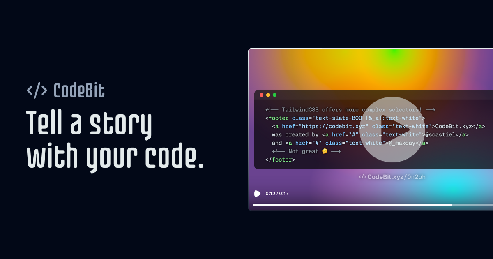

# CodeBit

**Tell a story with your code.** CodeBit turns markdown-defined code snippets into animated videos you can share with your community.

Try it live at [codebit.xyz](https://codebit.xyz).



## Features

- Write code sequences in plain Markdown — no new syntax to learn
- Live preview with typing animations between steps
- Customizable colors, fonts, backgrounds, and highlight themes
- Export as MP4 video, rendered entirely in your browser
- 100% free, no account, no sign-up — everything runs client-side

## Stack

- **Build / dev**: [Vite](https://vitejs.dev/) + [React 18](https://react.dev/)
- **Routing**: [TanStack Router](https://tanstack.com/router) (code-based)
- **Styling**: [Tailwind CSS](https://tailwindcss.com/) + [shadcn/ui](https://ui.shadcn.com/)
- **Editor**: [Monaco](https://microsoft.github.io/monaco-editor/)
- **Video pipeline**: [Remotion](https://www.remotion.dev/) — `@remotion/player` for preview, `@remotion/web-renderer` (WebCodecs) for in-browser MP4 export
- **Persistence**: `localStorage` — no backend
- **Tests**: Jest + ts-jest + jsdom
- **Language**: TypeScript

## Run it locally

```bash
git clone https://github.com/scastiel/codebit.git
cd codebit
npm install
npm run dev
```

The app will be available at [http://localhost:3000](http://localhost:3000).

### Scripts

- `npm run dev` — start the Vite dev server
- `npm run build` — type-check and build to `dist/`
- `npm start` — preview the production build
- `npm run lint` — run ESLint
- `npm test` — run the Jest test suite
- `npm run remotion-studio` — open Remotion Studio to preview the composition in isolation

### Environment variables

Both are optional:

- `VITE_BASE_URL` — absolute URL used by the video watermark (defaults to `http://localhost:3000`)
- `VITE_PLAUSIBLE_DOMAIN` — enables [Plausible Analytics](https://plausible.io/) injection if set

## Sponsor

CodeBit is free and open source. If you enjoy using it, you can [sponsor me on GitHub](https://github.com/sponsors/scastiel) to support its development. ♥

## License

MIT — see [LICENSE](LICENSE) if present, otherwise consider the code MIT-licensed.

## Credits

Made with ♥ in Montreal by [@scastiel](https://scastiel.dev) and [@maxday](https://maxday.dev).
